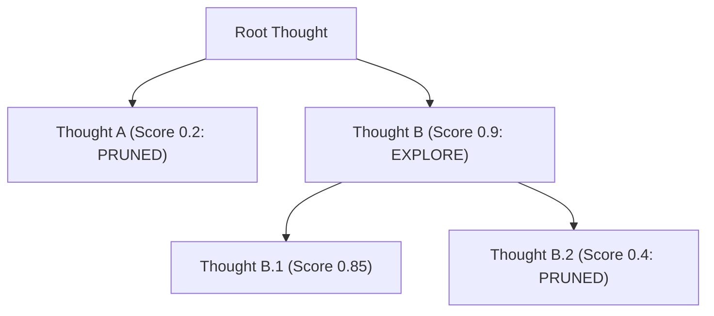

# genpark-backtracking-tree-search-pruning-controller-skill

Tree of Thoughts (ToT) backtracking controller scoring reasoning paths and pruning non-viable exploration branches.

## Architecture

## Features
- **Pruning Threshold**: Cuts dead ends before resource exhaustion.
- **Pure Python**: 100% standard library.
